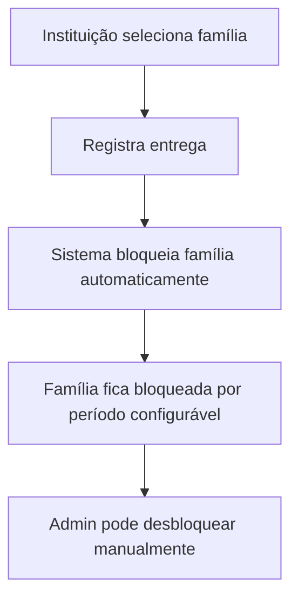
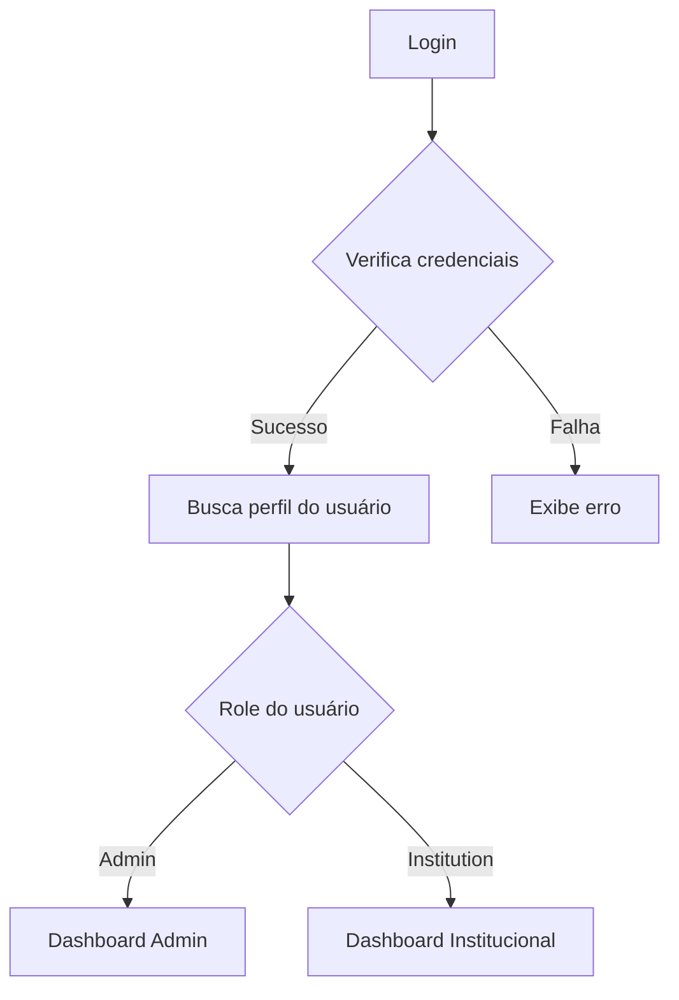

# CONTEXT.md

## Estado Atual do Sistema Cesta Control Hub

**Versão:** 1.0.0  
**Última Atualização:** Janeiro 2025  
**Plataforma:** Web Application  
**Framework:** React + Vite + TypeScript  
**Status:** ✅ Production Ready (95% completo)

---

## 🎯 Visão Geral do Sistema

Cesta Control Hub (CestaJusta) é uma aplicação web completa para gestão de distribuição de cestas básicas. A aplicação permite que administradores e instituições parceiras gerenciem famílias cadastradas, controlem entregas de cestas básicas, gerenciem fornecedores e estoque, e evitem duplicação de benefícios através de um sistema de bloqueio automático. O sistema também está em conformidade com a LGPD (Lei Geral de Proteção de Dados).

### Funcionalidades Principais

- **Gestão de Instituições** com cadastro completo e criação automática de usuários
- **Controle de Famílias** com sistema de bloqueio automático e busca por CPF
- **Registro de Entregas** com controle de períodos de bloqueio e validações
- **Sistema de Fornecedores e Estoque** completo com controle de produtos e movimentações
- **Geração de Recibos** em PDF para entregas e movimentações de estoque
- **Dashboard Administrativo** com métricas e relatórios em tempo real
- **Dashboard Institucional** específico para cada instituição
- **Sistema de Autenticação** completo com roles (admin/institution) e recuperação de senha
- **Conformidade LGPD** com Portal do Titular e Política de Privacidade
- **Integração com Supabase** para persistência de dados e autenticação

---

## 🏗️ Estrutura de Módulos

### 1. **Módulo de Autenticação** (`src/hooks/useAuth.tsx`)

**Estado:** ✅ Implementado

- **useAuth.tsx** - Gerenciamento de autenticação com Supabase
- **ProtectedRoute.tsx** - Proteção de rotas baseada em roles
- **Login.tsx** - Interface de login

**Fluxo:**

```
Login → Supabase Auth → Profile Fetch → Role-based Redirect
```

### 2. **Módulo Administrativo** (`src/pages/`)

**Estado:** ✅ Implementado

- **Index.tsx** - Dashboard principal do admin
- **Institutions.tsx** - Gestão de instituições
- **Families.tsx** - Gestão de famílias com bloqueio
- **Reports.tsx** - Relatórios e métricas
- **DeliveryManagement.tsx** - Controle de entregas

### 3. **Módulo Institucional** (`src/pages/institution/`)

**Estado:** ✅ Implementado

- **InstitutionDashboard.tsx** - Dashboard específico da instituição
- **InstitutionFamilies.tsx** - Famílias atendidas pela instituição
- **InstitutionReports.tsx** - Relatórios da instituição
- **InstitutionDelivery.tsx** - Registro de entregas
- **InstitutionSuppliers.tsx** - Gestão de fornecedores e estoque

### 4. **Módulo de Fornecedores e Estoque** (`src/hooks/useSuppliers.ts`, `src/hooks/useProducts.ts`, `src/hooks/useInventory.ts`)

**Estado:** ✅ Implementado

- **useSuppliers.ts** - CRUD completo de fornecedores (PF/PJ)
- **useProducts.ts** - CRUD completo de produtos com soft delete
- **useInventory.ts** - Controle de estoque por instituição
- **useReceipts.ts** - Geração de recibos em PDF
- **StockMovementsTab** - Histórico de movimentações de estoque
- **InventoryTab** - Visualização e gestão de estoque
- **ProductsTab** - Gestão de produtos
- **SuppliersTab** - Gestão de fornecedores

**Funcionalidades:**
- Cadastro de fornecedores (Pessoa Física ou Jurídica)
- Cadastro de produtos com unidades de medida
- Controle de estoque por instituição
- Movimentações de entrada e saída de estoque
- Integração automática com entregas (saída de estoque)
- Geração de recibos em PDF para movimentações e entregas
- Validação de estoque suficiente antes de saídas

### 5. **Módulo de Conformidade LGPD** (`src/pages/TitularPortal.tsx`, `src/pages/PrivacyPolicy.tsx`)

**Estado:** ✅ Implementado

- **TitularPortal.tsx** - Portal para exercer direitos LGPD
- **PrivacyPolicy.tsx** - Política de Privacidade completa
- **ConsentManagement.tsx** - Gestão de consentimento de dados
- **Login.tsx** - Aceite obrigatório de política de privacidade

**Funcionalidades:**
- Portal do Titular para exercer direitos (acesso, correção, exclusão, portabilidade)
- Política de Privacidade detalhada em conformidade com LGPD
- Aceite obrigatório de política no primeiro login
- Gestão de consentimento de dados pessoais
- Links para política e portal em todas as páginas públicas

---

## 🔄 Fluxos Principais

### Fluxo de Entrega de Cesta



### Fluxo de Autenticação



---

## 🧩 Componentes Principais

### Componentes de UI (`src/components/`)

**Estado:** ✅ Implementado

#### Navegação

- **Header** - Cabeçalho com logout
- **NavigationButtons** - Navegação para admin
- **InstitutionNavigationButtons** - Navegação para instituições

#### Dashboard

- **DashboardCard** - Cards de estatísticas
- **DeliveriesChart** - Gráfico de entregas
- **RecentDeliveriesTable** - Tabela de entregas recentes

#### Formulários

- **Form components** - Componentes de formulário com validação
- **Dialog components** - Modais para edição e detalhes
- **SearchFamilyByCpf.tsx** - Busca de famílias por CPF ou nome
- **FamilyInstitutionAssociation.tsx** - Associação família-instituição
- **FamilyInstitutionLink.tsx** - Vinculação de famílias

#### Fornecedores e Estoque

- **SuppliersTab** - Gestão de fornecedores
- **ProductsTab** - Gestão de produtos
- **InventoryTab** - Visualização de estoque
- **StockMovementsTab** - Histórico de movimentações
- **StockEntryForm** - Formulário de entrada de estoque
- **StockExitForm** - Formulário de saída de estoque
- **DeliveryDetailsModal** - Detalhes de entrega com recibo

#### LGPD e Conformidade

- **ConsentManagement.tsx** - Gestão de consentimento
- **FraudAlertDialog.tsx** - Alertas de possível fraude
- **PublicHeader.tsx** - Cabeçalho para páginas públicas
- **Footer.tsx** - Rodapé com links LGPD

---

## 🔌 Integrações Externas

### 1. **Supabase** (`src/integrations/supabase/`)

**Estado:** ✅ Configurado

- **Função:** Banco de dados e autenticação
- **Uso:** Persistência de dados, autenticação de usuários
- **Configuração:** URL e chave pública configuradas

### 2. **React Query** (`@tanstack/react-query`)

**Estado:** ✅ Implementado

- **Função:** Gerenciamento de estado servidor
- **Uso:** Cache de dados, sincronização com API
- **Hooks:** useDashboardStats, useDeliveries, useFamilies

---

## 📱 Gerenciamento de Estado

### React Query Hooks (`src/hooks/`)

**Estado:** ✅ Implementado

#### useDashboardStats

- **Função:** Busca estatísticas do dashboard
- **Estado:** `totalInstitutions`, `totalFamilies`, `totalDeliveries`, `blockedFamilies` (admin) ou `associatedFamilies`, `institutionDeliveries`, `blockedByInstitution` (instituição)
- **Ações:** Queries automáticas baseadas no role do usuário

#### useAuth

- **Função:** Gerenciamento de autenticação completo
- **Estado:** `user`, `session`, `profile`, `loading`
- **Ações:** `signIn`, `signOut`, `signUp`
- **Recursos:** Bootstrap automático de admin, criação automática de perfis, recuperação de senha

#### useFamilies

- **Função:** CRUD completo de famílias
- **Hooks:** `useFamilies`, `useInstitutionFamilies`, `useCreateFamily`, `useUpdateFamily`, `useDeleteFamily`
- **Recursos:** Busca por CPF, associação com instituições, desbloqueio automático de expirados

#### useInstitutions

- **Função:** CRUD completo de instituições
- **Hooks:** `useInstitutions`, `useCreateInstitution`, `useUpdateInstitution`, `useDeleteInstitution`, `useInstitutionData`
- **Recursos:** Criação automática de usuário, vinculação de perfil, validação de email único

#### useDeliveries

- **Função:** CRUD completo de entregas
- **Hooks:** `useDeliveries`, `useCreateDelivery`, `useUpdateDelivery`, `useDeleteDelivery`
- **Recursos:** Validação de bloqueio, validação de vínculo família-instituição, bloqueio automático

#### useSuppliers

- **Função:** CRUD completo de fornecedores
- **Hooks:** `useSuppliers`, `useCreateSupplier`, `useUpdateSupplier`, `useDeleteSupplier`
- **Recursos:** Suporte a PF e PJ, validação de movimentações antes de exclusão

#### useProducts

- **Função:** CRUD completo de produtos
- **Hooks:** `useProducts`, `useAllProducts`, `useCreateProduct`, `useUpdateProduct`, `useDeleteProduct`
- **Recursos:** Soft delete (desativação), unidades de medida, validação de nome único

#### useInventory

- **Função:** Gestão de estoque e movimentações
- **Hooks:** `useInventory`, `useStockMovements`, `useCreateStockMovement`
- **Recursos:** Controle por instituição, validação de estoque suficiente, integração com entregas

#### useReceipts

- **Função:** Geração de recibos em PDF
- **Hooks:** `useReceipts`, `useGenerateReceipt`, `useGenerateMovementReceipt`, `useGenerateDeliveryReceipt`
- **Recursos:** Geração de PDF com jsPDF, abertura automática no navegador, IDs de transação sequenciais

#### useReportExport

- **Função:** Exportação de relatórios
- **Recursos:** Exportação de dados para diferentes formatos

#### useAlerts

- **Função:** Sistema de alertas e notificações
- **Recursos:** Alertas de possível fraude, notificações de bloqueios

---

## 🎨 Sistema de Design

### Styling

- **Framework:** Tailwind CSS
- **UI Library:** shadcn/ui + Radix UI
- **Fonts:** Sistema padrão
- **Cores:** Sistema de cores customizado com tema primário
- **Temas:** Suporte a modo claro

### Componentes UI

- **Padrão:** Componentes reutilizáveis baseados em Radix UI
- **Variantes:** Sistema de variantes com class-variance-authority
- **Utilitários:** clsx e tailwind-merge para classes condicionais

---

## 📊 Estado Atual por Módulo

| Módulo                     | Status | Completude | Observações                           |
| -------------------------- | ------ | ---------- | ------------------------------------- |
| **Autenticação**           | ✅     | 100%       | Sistema completo com roles, recuperação de senha, bootstrap automático |
| **Dashboard Admin**        | ✅     | 100%       | Métricas completas com dados reais   |
| **Dashboard Instituição**  | ✅     | 100%       | Funcionalidades completas com dados reais |
| **Gestão de Instituições** | ✅     | 100%       | CRUD completo integrado com Supabase, criação automática de usuários |
| **Gestão de Famílias**     | ✅     | 100%       | CRUD completo, sistema de bloqueio funcionando, busca por CPF |
| **Entregas**               | ✅     | 100%       | CRUD completo, validações funcionando, bloqueio automático |
| **Fornecedores e Estoque** | ✅     | 100%       | Sistema completo com CRUD de fornecedores, produtos, estoque e movimentações |
| **Geração de Recibos**     | ✅     | 100%       | Geração de PDFs para entregas e movimentações |
| **Conformidade LGPD**      | ✅     | 100%       | Portal do Titular, Política de Privacidade, gestão de consentimento |
| **Relatórios**             | ✅     | 85%        | Estrutura completa, exportação implementada |

---

## 🔍 Pontos de Atenção

### Funcionalidades Implementadas

- ✅ Integração completa com Supabase para CRUD de instituições, famílias e entregas
- ✅ Sistema de bloqueio automático funcionando com validações
- ✅ Busca de famílias por CPF ou nome
- ✅ Sistema completo de fornecedores e estoque
- ✅ Geração de recibos em PDF
- ✅ Conformidade LGPD com Portal do Titular
- ✅ Exportação de relatórios

### Melhorias Identificadas

- Implementar busca e filtros avançados nas listagens
- Adicionar paginação para grandes volumes de dados
- Melhorar responsividade em dispositivos móveis (já está responsivo, mas pode melhorar)
- Implementar cache offline
- Adicionar mais validações de formulário com Zod schemas
- Implementar testes automatizados

### Dependências Críticas

- **Supabase:** Crítica para persistência de dados e autenticação
- **React Query:** Crítica para gerenciamento de estado servidor
- **shadcn/ui:** Importante para consistência visual

---

## 📈 Métricas do Projeto

- **Arquivos de Código:** 100+ arquivos TypeScript/TSX
- **Componentes:** 50+ componentes reutilizáveis (incluindo shadcn/ui)
- **Páginas:** 15+ telas implementadas
- **Hooks Customizados:** 15+ hooks React Query
- **Tabelas do Banco:** 10 tabelas principais
- **APIs Integradas:** 1 serviço (Supabase)
- **Idiomas Suportados:** 1 (Português)
- **Plataformas:** Web (responsivo)

---

## 🗄️ Estrutura do Banco de Dados

### Tabelas Principais

- **institutions** - Instituições parceiras
- **families** - Famílias cadastradas com sistema de bloqueio
- **profiles** - Perfis de usuários com roles
- **deliveries** - Registro de entregas de cestas
- **institution_families** - Relacionamento N-N entre instituições e famílias
- **suppliers** - Fornecedores (PF/PJ)
- **products** - Produtos cadastrados no sistema
- **inventory** - Estoque por instituição e produto
- **stock_movements** - Movimentações de estoque (entrada/saída)
- **receipts** - Registro de recibos gerados

### Funcionalidades Automáticas

- **Bloqueio automático** de famílias após entrega
- **Desbloqueio automático** de famílias quando período expira
- **Criação automática** de perfil ao registrar usuário
- **Atualização automática** de timestamps
- **Atualização automática** de estoque ao registrar movimentações
- **Geração automática** de IDs de transação para recibos
- **Validação automática** de entregas antes de registro

---

## 🚀 Tecnologias Utilizadas

### Frontend

- **React 18** - Framework principal
- **TypeScript** - Tipagem estática
- **Vite** - Build tool e dev server
- **Tailwind CSS** - Styling
- **shadcn/ui** - Componentes UI
- **React Router** - Roteamento
- **React Hook Form** - Formulários
- **React Query** - Estado servidor
- **jsPDF** - Geração de PDFs
- **date-fns** - Manipulação de datas
- **Zod** - Validação de schemas
- **Recharts** - Gráficos e visualizações

### Backend/Infraestrutura

- **Supabase** - Backend as a Service
- **PostgreSQL** - Banco de dados
- **Row Level Security** - Segurança de dados
- **Supabase Storage** - Armazenamento de arquivos (preparado para recibos)

### Desenvolvimento

- **ESLint** - Linting
- **Prettier** - Formatação
- **Lovable** - Plataforma de desenvolvimento

---

## 📋 Próximos Passos Sugeridos

### Curto Prazo (1-2 semanas)

- [x] Completar integração CRUD com Supabase ✅
- [x] Implementar validações de formulário ✅
- [x] Adicionar loading states e error handling ✅
- [ ] Melhorar busca e filtros avançados
- [ ] Adicionar paginação para grandes volumes

### Médio Prazo (1-2 meses)

- [x] Implementar sistema de relatórios completo ✅
- [ ] Adicionar notificações push
- [ ] Implementar busca e filtros avançados com múltiplos critérios
- [ ] Adicionar testes automatizados (unitários e E2E)
- [ ] Melhorar performance de queries complexas

### Longo Prazo (3-6 meses)

- [ ] Implementar PWA para uso offline
- [ ] Adicionar sistema de auditoria completo
- [ ] Implementar backup automático
- [ ] Adicionar analytics e métricas avançadas
- [ ] Implementar sistema de notificações por email

---

## 🔗 DOCUMENTAÇÃO RELACIONADA

### Documentação Principal

- **📄 [MVP_STATUS.md](./docs/MVP_STATUS.md)** - Estado atual do MVP e gaps
- **📄 [BUSINESS_RULES.md](./docs/BUSINESS_RULES.md)** - Regras de negócio detalhadas
- **📄 [FRONTEND_TASKS.md](./docs/FRONTEND_TASKS.md)** - Tarefas específicas do frontend
- **📄 [BACKEND_TASKS.md](./docs/BACKEND_TASKS.md)** - Requisitos do backend
- **📄 [SUPABASE_INTEGRATION_GUIDE.md](./docs/SUPABASE_INTEGRATION_GUIDE.md)** - Guia de integração
- **📄 [DATABASE_SETUP.md](./docs/DATABASE_SETUP.md)** - Configuração do banco
- **📄 [API_INTEGRATION.md](./docs/API_INTEGRATION.md)** - Padrões de API

### Desenvolvimento Multi-Agent

- **📄 [DEVELOPMENT_AUTOMATION.md](./docs/DEVELOPMENT_AUTOMATION.md)** - Guia de automação para desenvolvedores
- **📄 [AGENTS_COORDINATION.md](./docs/AGENTS_COORDINATION.md)** - Coordenação entre múltiplos agentes
- **📄 [AGENT_INSTRUCTIONS.md](./docs/AGENT_INSTRUCTIONS.md)** - Instruções simples para cada agente
- **📁 [docs/tasks/](./docs/tasks/)** - Arquivos de tarefas por agente
  - **📄 [agent-1-institutions.md](./docs/tasks/agent-1-institutions.md)** - Tarefas do Agente 1 (Instituições)
  - **📄 [agent-2-families.md](./docs/tasks/agent-2-families.md)** - Tarefas do Agente 2 (Famílias)
  - **📄 [agent-3-deliveries.md](./docs/tasks/agent-3-deliveries.md)** - Tarefas do Agente 3 (Entregas)

### Setup Supabase (CRÍTICO - EXECUTAR AGORA)

- **📄 [SUPABASE_SETUP_CHECKLIST.md](./docs/SUPABASE_SETUP_CHECKLIST.md)** - Scripts SQL para executar no seu projeto real
