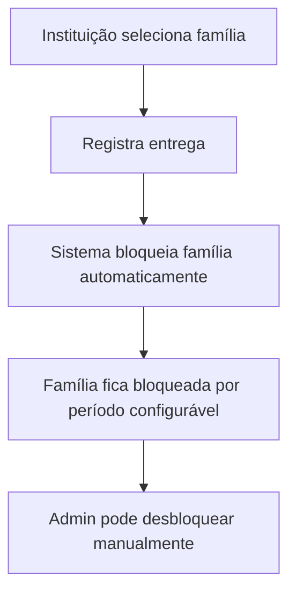
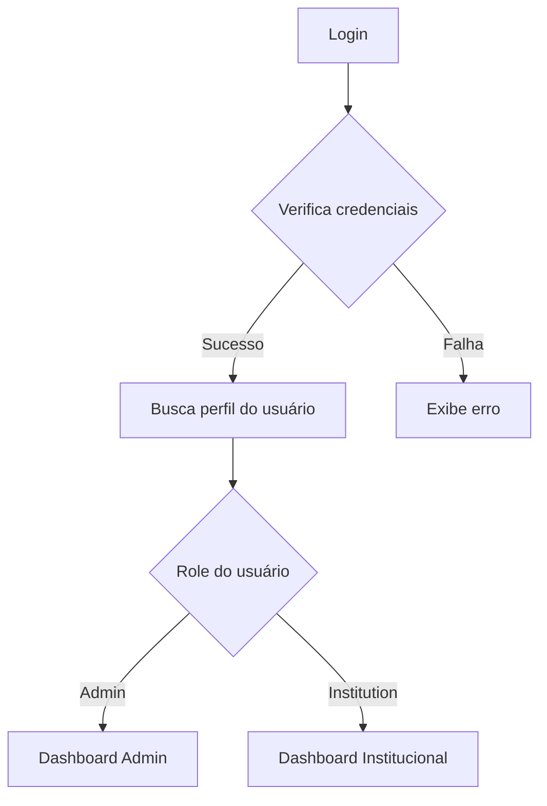

# CONTEXT.md

## Estado Atual do Sistema Cesta Control Hub

**Versão:** 1.0.0  
**Última Atualização:** Janeiro 2025  
**Plataforma:** Web Application  
**Framework:** React + Vite + TypeScript

---

## 🎯 Visão Geral do Sistema

Cesta Control Hub é uma aplicação web focada em gestão de distribuição de cestas básicas. A aplicação permite que administradores e instituições parceiras gerenciem famílias cadastradas, controlem entregas de cestas básicas e evitem duplicação de benefícios através de um sistema de bloqueio automático.

### Funcionalidades Principais

- **Gestão de Instituições** com cadastro e edição de dados
- **Controle de Famílias** com sistema de bloqueio automático
- **Registro de Entregas** com controle de períodos de bloqueio
- **Dashboard Administrativo** com métricas e relatórios
- **Dashboard Institucional** específico para cada instituição
- **Sistema de Autenticação** com roles (admin/institution)
- **Integração com Supabase** para persistência de dados

---

## 🏗️ Estrutura de Módulos

### 1. **Módulo de Autenticação** (`src/hooks/useAuth.tsx`)

**Estado:** ✅ Implementado

- **useAuth.tsx** - Gerenciamento de autenticação com Supabase
- **ProtectedRoute.tsx** - Proteção de rotas baseada em roles
- **Login.tsx** - Interface de login

**Fluxo:**

```
Login → Supabase Auth → Profile Fetch → Role-based Redirect
```

### 2. **Módulo Administrativo** (`src/pages/`)

**Estado:** ✅ Implementado

- **Index.tsx** - Dashboard principal do admin
- **Institutions.tsx** - Gestão de instituições
- **Families.tsx** - Gestão de famílias com bloqueio
- **Reports.tsx** - Relatórios e métricas
- **DeliveryManagement.tsx** - Controle de entregas

### 3. **Módulo Institucional** (`src/pages/institution/`)

**Estado:** ✅ Implementado

- **InstitutionDashboard.tsx** - Dashboard específico da instituição
- **InstitutionFamilies.tsx** - Famílias atendidas pela instituição
- **InstitutionReports.tsx** - Relatórios da instituição
- **InstitutionDelivery.tsx** - Registro de entregas

---

## 🔄 Fluxos Principais

### Fluxo de Entrega de Cesta



### Fluxo de Autenticação



---

## 🧩 Componentes Principais

### Componentes de UI (`src/components/`)

**Estado:** ✅ Implementado

#### Navegação

- **Header** - Cabeçalho com logout
- **NavigationButtons** - Navegação para admin
- **InstitutionNavigationButtons** - Navegação para instituições

#### Dashboard

- **DashboardCard** - Cards de estatísticas
- **DeliveriesChart** - Gráfico de entregas
- **RecentDeliveriesTable** - Tabela de entregas recentes

#### Formulários

- **Form components** - Componentes de formulário com validação
- **Dialog components** - Modais para edição e detalhes

---

## 🔌 Integrações Externas

### 1. **Supabase** (`src/integrations/supabase/`)

**Estado:** ✅ Configurado

- **Função:** Banco de dados e autenticação
- **Uso:** Persistência de dados, autenticação de usuários
- **Configuração:** URL e chave pública configuradas

### 2. **React Query** (`@tanstack/react-query`)

**Estado:** ✅ Implementado

- **Função:** Gerenciamento de estado servidor
- **Uso:** Cache de dados, sincronização com API
- **Hooks:** useDashboardStats, useDeliveries, useFamilies

---

## 📱 Gerenciamento de Estado

### React Query Hooks (`src/hooks/`)

**Estado:** ✅ Implementado

#### useDashboardStats

- **Função:** Busca estatísticas do dashboard
- **Estado:** `totalInstitutions`, `totalFamilies`, `totalDeliveries`, `blockedFamilies`
- **Ações:** Queries automáticas baseadas no role do usuário

#### useAuth

- **Função:** Gerenciamento de autenticação
- **Estado:** `user`, `session`, `profile`, `loading`
- **Ações:** `signIn`, `signOut`

---

## 🎨 Sistema de Design

### Styling

- **Framework:** Tailwind CSS
- **UI Library:** shadcn/ui + Radix UI
- **Fonts:** Sistema padrão
- **Cores:** Sistema de cores customizado com tema primário
- **Temas:** Suporte a modo claro

### Componentes UI

- **Padrão:** Componentes reutilizáveis baseados em Radix UI
- **Variantes:** Sistema de variantes com class-variance-authority
- **Utilitários:** clsx e tailwind-merge para classes condicionais

---

## 📊 Estado Atual por Módulo

| Módulo                     | Status | Completude | Observações                           |
| -------------------------- | ------ | ---------- | ------------------------------------- |
| **Autenticação**           | ✅     | 90%        | Sistema completo com roles            |
| **Dashboard Admin**        | ✅     | 85%        | Métricas básicas implementadas        |
| **Dashboard Instituição**  | ✅     | 80%        | Funcionalidades específicas           |
| **Gestão de Instituições** | ✅     | 75%        | CRUD básico com dados mock            |
| **Gestão de Famílias**     | ✅     | 80%        | Sistema de bloqueio implementado      |
| **Relatórios**             | ⚠️     | 60%        | Estrutura básica criada               |
| **Entregas**               | ⚠️     | 70%        | Interface criada, integração pendente |

---

## 🔍 Pontos de Atenção

### Funcionalidades Pendentes

- Integração completa com Supabase para CRUD de instituições
- Implementação de relatórios com dados reais
- Sistema de notificações para bloqueios
- Validação de períodos de bloqueio
- Exportação de relatórios

### Melhorias Identificadas

- Implementar busca e filtros nas listagens
- Adicionar paginação para grandes volumes de dados
- Melhorar responsividade em dispositivos móveis
- Implementar cache offline
- Adicionar validações de formulário mais robustas

### Dependências Críticas

- **Supabase:** Crítica para persistência de dados e autenticação
- **React Query:** Crítica para gerenciamento de estado servidor
- **shadcn/ui:** Importante para consistência visual

---

## 📈 Métricas do Projeto

- **Arquivos de Código:** 50+ arquivos TypeScript/TSX
- **Componentes:** 20+ componentes reutilizáveis
- **Páginas:** 10+ telas implementadas
- **APIs Integradas:** 1 serviço (Supabase)
- **Idiomas Suportados:** 1 (Português)
- **Plataformas:** Web (responsivo)

---

## 🗄️ Estrutura do Banco de Dados

### Tabelas Principais

- **institutions** - Instituições parceiras
- **families** - Famílias cadastradas com sistema de bloqueio
- **profiles** - Perfis de usuários com roles
- **deliveries** - Registro de entregas de cestas
- **institution_families** - Relacionamento N-N entre instituições e famílias

### Funcionalidades Automáticas

- **Bloqueio automático** de famílias após entrega
- **Criação automática** de perfil ao registrar usuário
- **Atualização automática** de timestamps

---

## 🚀 Tecnologias Utilizadas

### Frontend

- **React 18** - Framework principal
- **TypeScript** - Tipagem estática
- **Vite** - Build tool e dev server
- **Tailwind CSS** - Styling
- **shadcn/ui** - Componentes UI
- **React Router** - Roteamento
- **React Hook Form** - Formulários
- **React Query** - Estado servidor

### Backend/Infraestrutura

- **Supabase** - Backend as a Service
- **PostgreSQL** - Banco de dados
- **Row Level Security** - Segurança de dados

### Desenvolvimento

- **ESLint** - Linting
- **Prettier** - Formatação
- **Lovable** - Plataforma de desenvolvimento

---

## 📋 Próximos Passos Sugeridos

### Curto Prazo (1-2 semanas)

- [ ] Completar integração CRUD com Supabase
- [ ] Implementar validações de formulário
- [ ] Adicionar loading states e error handling
- [ ] Melhorar responsividade mobile

### Médio Prazo (1-2 meses)

- [ ] Implementar sistema de relatórios completo
- [ ] Adicionar notificações push
- [ ] Implementar busca e filtros avançados
- [ ] Adicionar testes automatizados

### Longo Prazo (3-6 meses)

- [ ] Implementar PWA
- [ ] Adicionar sistema de auditoria
- [ ] Implementar backup automático
- [ ] Adicionar analytics e métricas avançadas

---

## 🔗 DOCUMENTAÇÃO RELACIONADA

### Documentação Principal

- **📄 [MVP_STATUS.md](./docs/MVP_STATUS.md)** - Estado atual do MVP e gaps
- **📄 [BUSINESS_RULES.md](./docs/BUSINESS_RULES.md)** - Regras de negócio detalhadas
- **📄 [FRONTEND_TASKS.md](./docs/FRONTEND_TASKS.md)** - Tarefas específicas do frontend
- **📄 [BACKEND_TASKS.md](./docs/BACKEND_TASKS.md)** - Requisitos do backend
- **📄 [SUPABASE_INTEGRATION_GUIDE.md](./docs/SUPABASE_INTEGRATION_GUIDE.md)** - Guia de integração
- **📄 [DATABASE_SETUP.md](./docs/DATABASE_SETUP.md)** - Configuração do banco
- **📄 [API_INTEGRATION.md](./docs/API_INTEGRATION.md)** - Padrões de API

### Desenvolvimento Multi-Agent

- **📄 [DEVELOPMENT_AUTOMATION.md](./docs/DEVELOPMENT_AUTOMATION.md)** - Guia de automação para desenvolvedores
- **📄 [AGENTS_COORDINATION.md](./docs/AGENTS_COORDINATION.md)** - Coordenação entre múltiplos agentes
- **📄 [AGENT_INSTRUCTIONS.md](./docs/AGENT_INSTRUCTIONS.md)** - Instruções simples para cada agente
- **📁 [docs/tasks/](./docs/tasks/)** - Arquivos de tarefas por agente
  - **📄 [agent-1-institutions.md](./docs/tasks/agent-1-institutions.md)** - Tarefas do Agente 1 (Instituições)
  - **📄 [agent-2-families.md](./docs/tasks/agent-2-families.md)** - Tarefas do Agente 2 (Famílias)
  - **📄 [agent-3-deliveries.md](./docs/tasks/agent-3-deliveries.md)** - Tarefas do Agente 3 (Entregas)

### Setup Supabase (CRÍTICO - EXECUTAR AGORA)

- **📄 [SUPABASE_SETUP_CHECKLIST.md](./docs/SUPABASE_SETUP_CHECKLIST.md)** - Scripts SQL para executar no seu projeto real
