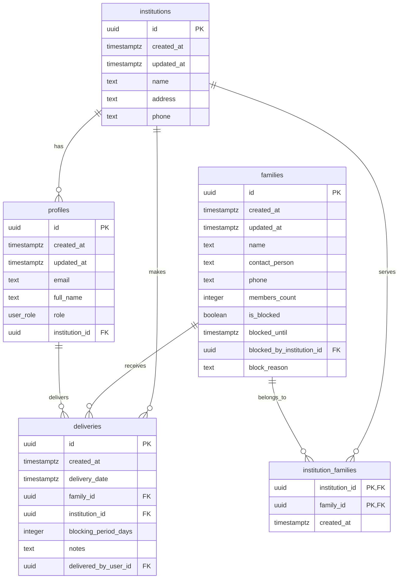

# DATABASE_SETUP.md

## Configuração do Banco de Dados - Cesta Control Hub

**Versão:** 1.0.0  
**Última Atualização:** Janeiro 2025  
**Plataforma:** Supabase (PostgreSQL)

---

## 🎯 Visão Geral

Este documento contém o schema completo do banco de dados, políticas RLS, funções auxiliares e scripts de dados de teste para o Cesta Control Hub.

---

## 🗄️ SCHEMA DO BANCO DE DADOS

### 1. **Diagrama de Relacionamentos**



### 2. **Tabelas Principais**

#### 2.1 Tabela `institutions`

```sql
CREATE TABLE public.institutions (
    id UUID PRIMARY KEY DEFAULT gen_random_uuid(),
    created_at TIMESTAMPTZ DEFAULT now(),
    updated_at TIMESTAMPTZ DEFAULT now(),
    name TEXT NOT NULL,
    address TEXT,
    phone TEXT,
    CONSTRAINT institutions_name_not_empty CHECK (length(trim(name)) > 0)
);

COMMENT ON TABLE public.institutions IS 'Armazena as informações das instituições parceiras.';

-- Índices
CREATE INDEX idx_institutions_name ON public.institutions(name);
```

#### 2.2 Tabela `families`

```sql
CREATE TABLE public.families (
    id UUID PRIMARY KEY DEFAULT gen_random_uuid(),
    created_at TIMESTAMPTZ DEFAULT now(),
    updated_at TIMESTAMPTZ DEFAULT now(),
    name TEXT NOT NULL,
    contact_person TEXT NOT NULL,
    phone TEXT,
    members_count INT DEFAULT 1,
    is_blocked BOOLEAN DEFAULT FALSE,
    blocked_until TIMESTAMPTZ,
    blocked_by_institution_id UUID REFERENCES public.institutions(id) ON DELETE SET NULL,
    block_reason TEXT,
    CONSTRAINT families_name_not_empty CHECK (length(trim(name)) > 0),
    CONSTRAINT families_contact_not_empty CHECK (length(trim(contact_person)) > 0),
    CONSTRAINT families_members_positive CHECK (members_count > 0),
    CONSTRAINT families_blocked_logic CHECK (
        (is_blocked = TRUE AND blocked_until IS NOT NULL) OR
        (is_blocked = FALSE)
    )
);

COMMENT ON TABLE public.families IS 'Tabela compartilhada de famílias. O bloqueio impede que recebam múltiplas cestas em um curto período.';

-- Índices
CREATE INDEX idx_families_name ON public.families(name);
CREATE INDEX idx_families_blocked ON public.families(is_blocked, blocked_until);
CREATE INDEX idx_families_blocked_by_institution ON public.families(blocked_by_institution_id);
```

#### 2.3 Tabela `profiles`

```sql
CREATE TABLE public.profiles (
    id UUID PRIMARY KEY REFERENCES auth.users(id) ON DELETE CASCADE,
    created_at TIMESTAMPTZ DEFAULT now(),
    updated_at TIMESTAMPTZ DEFAULT now(),
    email TEXT NOT NULL,
    full_name TEXT NOT NULL DEFAULT 'Usuário',
    role user_role NOT NULL DEFAULT 'institution',
    institution_id UUID REFERENCES public.institutions(id) ON DELETE SET NULL,
    CONSTRAINT profiles_email_not_empty CHECK (length(trim(email)) > 0),
    CONSTRAINT profiles_name_not_empty CHECK (length(trim(full_name)) > 0),
    CONSTRAINT profiles_institution_logic CHECK (
        (role = 'admin' AND institution_id IS NULL) OR
        (role = 'institution' AND institution_id IS NOT NULL)
    )
);

COMMENT ON TABLE public.profiles IS 'Armazena dados adicionais dos usuários, como sua permissão (role) e a qual instituição pertence.';

-- Índices
CREATE INDEX idx_profiles_role ON public.profiles(role);
CREATE INDEX idx_profiles_institution ON public.profiles(institution_id);
CREATE INDEX idx_profiles_email ON public.profiles(email);
```

#### 2.4 Tabela `deliveries`

```sql
CREATE TABLE public.deliveries (
    id UUID PRIMARY KEY DEFAULT gen_random_uuid(),
    created_at TIMESTAMPTZ DEFAULT now(),
    delivery_date TIMESTAMPTZ DEFAULT now(),
    family_id UUID NOT NULL REFERENCES public.families(id) ON DELETE RESTRICT,
    institution_id UUID NOT NULL REFERENCES public.institutions(id) ON DELETE RESTRICT,
    blocking_period_days INT NOT NULL DEFAULT 30,
    notes TEXT,
    delivered_by_user_id UUID REFERENCES auth.users(id) ON DELETE SET NULL,
    CONSTRAINT deliveries_blocking_period_positive CHECK (blocking_period_days > 0)
);

COMMENT ON TABLE public.deliveries IS 'Registra cada entrega de cesta, vinculando uma instituição a uma família.';

-- Índices
CREATE INDEX idx_deliveries_family ON public.deliveries(family_id);
CREATE INDEX idx_deliveries_institution ON public.deliveries(institution_id);
CREATE INDEX idx_deliveries_date ON public.deliveries(delivery_date);
CREATE INDEX idx_deliveries_user ON public.deliveries(delivered_by_user_id);
```

#### 2.5 Tabela `institution_families`

```sql
CREATE TABLE public.institution_families (
    institution_id UUID NOT NULL REFERENCES public.institutions(id) ON DELETE CASCADE,
    family_id UUID NOT NULL REFERENCES public.families(id) ON DELETE CASCADE,
    created_at TIMESTAMPTZ DEFAULT now(),
    PRIMARY KEY (institution_id, family_id)
);

COMMENT ON TABLE public.institution_families IS 'Associa quais instituições atendem quais famílias.';

-- Índices
CREATE INDEX idx_institution_families_institution ON public.institution_families(institution_id);
CREATE INDEX idx_institution_families_family ON public.institution_families(family_id);
```

### 3. **Enums**

```sql
-- Enum para roles de usuário
CREATE TYPE user_role AS ENUM ('admin', 'institution');

-- Enum para períodos de bloqueio
CREATE TYPE blocking_period AS ENUM ('7', '15', '20', '30', '45');
```

---

## 🔐 ROW LEVEL SECURITY (RLS)

### 1. **Habilitar RLS**

```sql
-- Habilitar RLS em todas as tabelas
ALTER TABLE public.institutions ENABLE ROW LEVEL SECURITY;
ALTER TABLE public.families ENABLE ROW LEVEL SECURITY;
ALTER TABLE public.profiles ENABLE ROW LEVEL SECURITY;
ALTER TABLE public.deliveries ENABLE ROW LEVEL SECURITY;
ALTER TABLE public.institution_families ENABLE ROW LEVEL SECURITY;
```

### 2. **Políticas para Admin**

```sql
-- Admin pode gerenciar todas as instituições
CREATE POLICY "Admin can manage all institutions" ON public.institutions
FOR ALL USING (
  EXISTS (
    SELECT 1 FROM public.profiles
    WHERE profiles.id = auth.uid()
    AND profiles.role = 'admin'
  )
);

-- Admin pode gerenciar todas as famílias
CREATE POLICY "Admin can manage all families" ON public.families
FOR ALL USING (
  EXISTS (
    SELECT 1 FROM public.profiles
    WHERE profiles.id = auth.uid()
    AND profiles.role = 'admin'
  )
);

-- Admin pode gerenciar todos os perfis
CREATE POLICY "Admin can manage all profiles" ON public.profiles
FOR ALL USING (
  EXISTS (
    SELECT 1 FROM public.profiles
    WHERE profiles.id = auth.uid()
    AND profiles.role = 'admin'
  )
);

-- Admin pode gerenciar todas as entregas
CREATE POLICY "Admin can manage all deliveries" ON public.deliveries
FOR ALL USING (
  EXISTS (
    SELECT 1 FROM public.profiles
    WHERE profiles.id = auth.uid()
    AND profiles.role = 'admin'
  )
);

-- Admin pode gerenciar todas as associações
CREATE POLICY "Admin can manage all institution_families" ON public.institution_families
FOR ALL USING (
  EXISTS (
    SELECT 1 FROM public.profiles
    WHERE profiles.id = auth.uid()
    AND profiles.role = 'admin'
  )
);
```

### 3. **Políticas para Instituição**

```sql
-- Instituição pode ver apenas seus próprios dados
CREATE POLICY "Institution can view own data" ON public.institutions
FOR SELECT USING (
  id = (
    SELECT institution_id FROM public.profiles
    WHERE profiles.id = auth.uid()
  )
);

-- Instituição pode gerenciar famílias vinculadas
CREATE POLICY "Institution can manage associated families" ON public.families
FOR ALL USING (
  id IN (
    SELECT family_id FROM public.institution_families
    WHERE institution_id = (
      SELECT institution_id FROM public.profiles
      WHERE profiles.id = auth.uid()
    )
  )
);

-- Instituição pode ver apenas seu próprio perfil
CREATE POLICY "Institution can view own profile" ON public.profiles
FOR SELECT USING (id = auth.uid());

-- Instituição pode gerenciar suas próprias entregas
CREATE POLICY "Institution can manage own deliveries" ON public.deliveries
FOR ALL USING (
  institution_id = (
    SELECT institution_id FROM public.profiles
    WHERE profiles.id = auth.uid()
  )
);

-- Instituição pode ver suas próprias associações
CREATE POLICY "Institution can view own associations" ON public.institution_families
FOR SELECT USING (
  institution_id = (
    SELECT institution_id FROM public.profiles
    WHERE profiles.id = auth.uid()
  )
);
```

---

## ⚙️ FUNÇÕES AUXILIARES

### 1. **Função de Criação de Perfil**

```sql
CREATE OR REPLACE FUNCTION public.handle_new_user()
RETURNS TRIGGER AS $$
BEGIN
  INSERT INTO public.profiles (id, email, full_name, role)
  VALUES (
    NEW.id,
    NEW.email,
    COALESCE(NEW.raw_user_meta_data->>'full_name', 'Usuário'),
    COALESCE((NEW.raw_user_meta_data->>'role')::user_role, 'institution')
  );
  RETURN NEW;
END;
$$ LANGUAGE plpgsql SECURITY DEFINER;

-- Trigger para criar perfil automaticamente
CREATE TRIGGER on_auth_user_created
  AFTER INSERT ON auth.users
  FOR EACH ROW EXECUTE PROCEDURE public.handle_new_user();
```

### 2. **Função de Bloqueio Automático**

```sql
CREATE OR REPLACE FUNCTION public.update_family_blocking()
RETURNS TRIGGER AS $$
BEGIN
  -- Atualizar o status de bloqueio da família
  UPDATE public.families
  SET
    is_blocked = true,
    blocked_until = NEW.delivery_date + (NEW.blocking_period_days || ' days')::INTERVAL,
    blocked_by_institution_id = NEW.institution_id,
    block_reason = 'Recebeu cesta básica',
    updated_at = now()
  WHERE id = NEW.family_id;

  RETURN NEW;
END;
$$ LANGUAGE plpgsql SECURITY DEFINER;

-- Trigger para bloquear família após entrega
CREATE TRIGGER on_delivery_created
  AFTER INSERT ON public.deliveries
  FOR EACH ROW EXECUTE PROCEDURE public.update_family_blocking();
```

### 3. **Função de Atualização de Timestamps**

```sql
CREATE OR REPLACE FUNCTION public.update_updated_at_column()
RETURNS TRIGGER AS $$
BEGIN
    NEW.updated_at = now();
    RETURN NEW;
END;
$$ LANGUAGE plpgsql;

-- Triggers para atualizar updated_at
CREATE TRIGGER update_institutions_updated_at
  BEFORE UPDATE ON public.institutions
  FOR EACH ROW EXECUTE PROCEDURE public.update_updated_at_column();

CREATE TRIGGER update_families_updated_at
  BEFORE UPDATE ON public.families
  FOR EACH ROW EXECUTE PROCEDURE public.update_updated_at_column();

CREATE TRIGGER update_profiles_updated_at
  BEFORE UPDATE ON public.profiles
  FOR EACH ROW EXECUTE PROCEDURE public.update_updated_at_column();
```

### 4. **Funções de Negócio**

#### 4.1 Associar Família a Instituição

```sql
CREATE OR REPLACE FUNCTION public.associate_family_institution(
  p_family_id UUID,
  p_institution_id UUID
)
RETURNS JSON AS $$
DECLARE
  result JSON;
BEGIN
  -- Verificar se família existe
  IF NOT EXISTS (SELECT 1 FROM public.families WHERE id = p_family_id) THEN
    RETURN json_build_object('success', false, 'error', 'Família não encontrada');
  END IF;

  -- Verificar se instituição existe
  IF NOT EXISTS (SELECT 1 FROM public.institutions WHERE id = p_institution_id) THEN
    RETURN json_build_object('success', false, 'error', 'Instituição não encontrada');
  END IF;

  -- Verificar se associação já existe
  IF EXISTS (
    SELECT 1 FROM public.institution_families
    WHERE family_id = p_family_id AND institution_id = p_institution_id
  ) THEN
    RETURN json_build_object('success', false, 'error', 'Associação já existe');
  END IF;

  -- Criar associação
  INSERT INTO public.institution_families (family_id, institution_id)
  VALUES (p_family_id, p_institution_id);

  RETURN json_build_object('success', true, 'message', 'Associação criada com sucesso');
END;
$$ LANGUAGE plpgsql SECURITY DEFINER;
```

#### 4.2 Verificar se Entrega é Permitida

```sql
CREATE OR REPLACE FUNCTION public.can_deliver_to_family(
  p_family_id UUID,
  p_institution_id UUID
)
RETURNS JSON AS $$
DECLARE
  family_record public.families%ROWTYPE;
  is_associated BOOLEAN;
BEGIN
  -- Buscar dados da família
  SELECT * INTO family_record FROM public.families WHERE id = p_family_id;

  IF NOT FOUND THEN
    RETURN json_build_object('can_deliver', false, 'reason', 'Família não encontrada');
  END IF;

  -- Verificar se família está bloqueada
  IF family_record.is_blocked THEN
    RETURN json_build_object(
      'can_deliver', false,
      'reason', 'Família bloqueada até ' || family_record.blocked_until::text
    );
  END IF;

  -- Verificar se família está vinculada à instituição
  SELECT EXISTS (
    SELECT 1 FROM public.institution_families
    WHERE family_id = p_family_id AND institution_id = p_institution_id
  ) INTO is_associated;

  IF NOT is_associated THEN
    RETURN json_build_object('can_deliver', false, 'reason', 'Família não vinculada a esta instituição');
  END IF;

  RETURN json_build_object('can_deliver', true, 'reason', null);
END;
$$ LANGUAGE plpgsql SECURITY DEFINER;
```

#### 4.3 Desbloquear Família

```sql
CREATE OR REPLACE FUNCTION public.unblock_family(
  p_family_id UUID,
  p_reason TEXT DEFAULT 'Desbloqueio manual pelo administrador'
)
RETURNS JSON AS $$
DECLARE
  user_role TEXT;
BEGIN
  -- Verificar se usuário é admin
  SELECT role INTO user_role FROM public.profiles WHERE id = auth.uid();

  IF user_role != 'admin' THEN
    RETURN json_build_object('success', false, 'error', 'Apenas administradores podem desbloquear famílias');
  END IF;

  -- Verificar se família existe
  IF NOT EXISTS (SELECT 1 FROM public.families WHERE id = p_family_id) THEN
    RETURN json_build_object('success', false, 'error', 'Família não encontrada');
  END IF;

  -- Desbloquear família
  UPDATE public.families
  SET
    is_blocked = false,
    blocked_until = null,
    blocked_by_institution_id = null,
    block_reason = p_reason,
    updated_at = now()
  WHERE id = p_family_id;

  RETURN json_build_object('success', true, 'message', 'Família desbloqueada com sucesso');
END;
$$ LANGUAGE plpgsql SECURITY DEFINER;
```

### 5. **Funções de Estatísticas**

#### 5.1 Estatísticas do Admin

```sql
CREATE OR REPLACE FUNCTION public.get_admin_stats()
RETURNS JSON AS $$
DECLARE
  total_institutions INTEGER;
  total_families INTEGER;
  total_deliveries INTEGER;
  blocked_families INTEGER;
BEGIN
  SELECT COUNT(*) INTO total_institutions FROM public.institutions;
  SELECT COUNT(*) INTO total_families FROM public.families;
  SELECT COUNT(*) INTO total_deliveries FROM public.deliveries;
  SELECT COUNT(*) INTO blocked_families FROM public.families WHERE is_blocked = true;

  RETURN json_build_object(
    'total_institutions', total_institutions,
    'total_families', total_families,
    'total_deliveries', total_deliveries,
    'blocked_families', blocked_families
  );
END;
$$ LANGUAGE plpgsql SECURITY DEFINER;
```

#### 5.2 Estatísticas da Instituição

```sql
CREATE OR REPLACE FUNCTION public.get_institution_stats(p_institution_id UUID)
RETURNS JSON AS $$
DECLARE
  associated_families INTEGER;
  institution_deliveries INTEGER;
  blocked_by_institution INTEGER;
  recent_deliveries INTEGER;
BEGIN
  -- Famílias associadas
  SELECT COUNT(*) INTO associated_families
  FROM public.institution_families
  WHERE institution_id = p_institution_id;

  -- Total de entregas da instituição
  SELECT COUNT(*) INTO institution_deliveries
  FROM public.deliveries
  WHERE institution_id = p_institution_id;

  -- Famílias bloqueadas por esta instituição
  SELECT COUNT(*) INTO blocked_by_institution
  FROM public.families
  WHERE blocked_by_institution_id = p_institution_id AND is_blocked = true;

  -- Entregas recentes (últimos 30 dias)
  SELECT COUNT(*) INTO recent_deliveries
  FROM public.deliveries
  WHERE institution_id = p_institution_id
  AND delivery_date >= (now() - interval '30 days');

  RETURN json_build_object(
    'associated_families', associated_families,
    'institution_deliveries', institution_deliveries,
    'blocked_by_institution', blocked_by_institution,
    'recent_deliveries', recent_deliveries
  );
END;
$$ LANGUAGE plpgsql SECURITY DEFINER;
```

---

## 🧪 DADOS DE TESTE

### 1. **Script Completo de Dados de Teste**

```sql
-- Limpar dados existentes (cuidado em produção!)
TRUNCATE TABLE public.deliveries CASCADE;
TRUNCATE TABLE public.institution_families CASCADE;
TRUNCATE TABLE public.families CASCADE;
TRUNCATE TABLE public.institutions CASCADE;

-- Inserir instituições de teste
INSERT INTO public.institutions (name, address, phone) VALUES
('Centro Comunitário São José', 'Rua das Flores, 123', '(11) 9999-8888'),
('Associação Bem-Estar', 'Av. Principal, 456', '(11) 7777-6666'),
('Igreja Nossa Senhora', 'Praça Central, 789', '(11) 5555-4444'),
('Instituto Esperança', 'Rua dos Sonhos, 101', '(11) 3333-2222');

-- Inserir famílias de teste
INSERT INTO public.families (name, contact_person, phone, members_count) VALUES
('Silva', 'João Silva', '(11) 1111-1111', 4),
('Santos', 'Maria Santos', '(11) 2222-2222', 3),
('Oliveira', 'Pedro Oliveira', '(11) 3333-3333', 5),
('Pereira', 'Ana Pereira', '(11) 4444-4444', 2),
('Costa', 'Carlos Costa', '(11) 5555-5555', 6);

-- Vincular famílias a instituições
INSERT INTO public.institution_families (institution_id, family_id)
SELECT i.id, f.id
FROM public.institutions i, public.families f
WHERE i.name = 'Centro Comunitário São José' AND f.name IN ('Silva', 'Santos', 'Oliveira');

INSERT INTO public.institution_families (institution_id, family_id)
SELECT i.id, f.id
FROM public.institutions i, public.families f
WHERE i.name = 'Associação Bem-Estar' AND f.name IN ('Santos', 'Pereira');

INSERT INTO public.institution_families (institution_id, family_id)
SELECT i.id, f.id
FROM public.institutions i, public.families f
WHERE i.name = 'Igreja Nossa Senhora' AND f.name IN ('Oliveira', 'Costa');

INSERT INTO public.institution_families (institution_id, family_id)
SELECT i.id, f.id
FROM public.institutions i, public.families f
WHERE i.name = 'Instituto Esperança' AND f.name IN ('Pereira', 'Costa');

-- Inserir algumas entregas de teste
INSERT INTO public.deliveries (family_id, institution_id, blocking_period_days, notes)
SELECT f.id, i.id, 30, 'Entrega de teste'
FROM public.families f, public.institutions i
WHERE f.name = 'Silva' AND i.name = 'Centro Comunitário São José';

INSERT INTO public.deliveries (family_id, institution_id, blocking_period_days, notes)
SELECT f.id, i.id, 30, 'Entrega de teste'
FROM public.families f, public.institutions i
WHERE f.name = 'Santos' AND i.name = 'Associação Bem-Estar';
```

### 2. **Script para Criar Usuários de Teste**

```sql
-- Criar usuário admin
INSERT INTO auth.users (
  id,
  email,
  encrypted_password,
  email_confirmed_at,
  created_at,
  updated_at,
  raw_user_meta_data
) VALUES (
  '11111111-2222-4333-8444-555555555555',
  'admin@araguari.mg.gov.br',
  crypt('admin123', gen_salt('bf')),
  now(),
  now(),
  now(),
  '{"full_name": "Administrador Sistema", "role": "admin"}'::jsonb
);

-- Criar perfil do admin
INSERT INTO public.profiles (id, email, full_name, role)
VALUES (
  '11111111-2222-4333-8444-555555555555',
  'admin@araguari.mg.gov.br',
  'Administrador Sistema',
  'admin'
);

-- Criar usuário de instituição
INSERT INTO auth.users (
  id,
  email,
  encrypted_password,
  email_confirmed_at,
  created_at,
  updated_at,
  raw_user_meta_data
) VALUES (
  '22222222-3333-4444-8555-666666666666',
  'instituicao@casesperanca.org.br',
  crypt('inst123', gen_salt('bf')),
  now(),
  now(),
  now(),
  json_build_object(
    'full_name', 'Responsável Instituição',
    'role', 'institution',
    'institution_id', (SELECT id FROM public.institutions WHERE name = 'Centro Comunitário São José')
  )::jsonb
);

-- Criar perfil da instituição
INSERT INTO public.profiles (id, email, full_name, role, institution_id)
VALUES (
  '22222222-3333-4444-8555-666666666666',
  'instituicao@casesperanca.org.br',
  'Responsável Instituição',
  'institution',
  (SELECT id FROM public.institutions WHERE name = 'Centro Comunitário São José')
);
```

---

## 🔧 COMANDOS DE MANUTENÇÃO

### 1. **Verificar Status do Banco**

```sql
-- Verificar tabelas e RLS
SELECT schemaname, tablename, rowsecurity
FROM pg_tables
WHERE schemaname = 'public';

-- Verificar políticas
SELECT schemaname, tablename, policyname, permissive, roles, cmd, qual
FROM pg_policies
WHERE schemaname = 'public';

-- Verificar triggers
SELECT trigger_name, event_manipulation, event_object_table, action_statement
FROM information_schema.triggers
WHERE trigger_schema = 'public';

-- Verificar funções
SELECT routine_name, routine_type, data_type
FROM information_schema.routines
WHERE routine_schema = 'public';
```

### 2. **Limpeza de Dados**

```sql
-- Limpar dados de teste (cuidado!)
TRUNCATE TABLE public.deliveries CASCADE;
TRUNCATE TABLE public.institution_families CASCADE;
TRUNCATE TABLE public.families CASCADE;
TRUNCATE TABLE public.institutions CASCADE;

-- Limpar usuários de teste
DELETE FROM auth.users WHERE email IN (
  'admin@araguari.mg.gov.br',
  'instituicao@casesperanca.org.br'
);
```

### 3. **Backup e Restore**

```sql
-- Backup de dados específicos
COPY public.institutions TO '/tmp/institutions.csv' WITH CSV HEADER;
COPY public.families TO '/tmp/families.csv' WITH CSV HEADER;
COPY public.deliveries TO '/tmp/deliveries.csv' WITH CSV HEADER;

-- Restore de dados
COPY public.institutions FROM '/tmp/institutions.csv' WITH CSV HEADER;
COPY public.families FROM '/tmp/families.csv' WITH CSV HEADER;
COPY public.deliveries FROM '/tmp/deliveries.csv' WITH CSV HEADER;
```

---

## 📋 CHECKLIST DE CONFIGURAÇÃO

### Schema

- [ ] Todas as tabelas criadas
- [ ] Constraints e índices aplicados
- [ ] Enums criados
- [ ] Relacionamentos configurados

### RLS

- [ ] RLS habilitado em todas as tabelas
- [ ] Políticas para admin criadas
- [ ] Políticas para instituição criadas
- [ ] Políticas testadas

### Funções

- [ ] Função de criação de perfil
- [ ] Função de bloqueio automático
- [ ] Função de atualização de timestamps
- [ ] Funções de negócio
- [ ] Funções de estatísticas

### Triggers

- [ ] Trigger de criação de perfil
- [ ] Trigger de bloqueio automático
- [ ] Triggers de atualização de timestamps
- [ ] Triggers testados

### Dados de Teste

- [ ] Instituições inseridas
- [ ] Famílias inseridas
- [ ] Associações criadas
- [ ] Usuários de teste criados
- [ ] Entregas de teste inseridas

---

## 🔗 DOCUMENTAÇÃO RELACIONADA

- **📄 [BACKEND_TASKS.md](./BACKEND_TASKS.md)** - Tarefas de backend
- **📄 [SUPABASE_INTEGRATION_GUIDE.md](./SUPABASE_INTEGRATION_GUIDE.md)** - Guia de integração
- **📄 [BUSINESS_RULES.md](./BUSINESS_RULES.md)** - Regras de negócio
- **📄 [API_INTEGRATION.md](./API_INTEGRATION.md)** - Padrões de API

---

## ⏱️ TEMPO ESTIMADO

| Tarefa                     | Tempo           |
| -------------------------- | --------------- |
| **Criar Schema**           | 2-3 horas       |
| **Configurar RLS**         | 3-4 horas       |
| **Criar Funções**          | 4-6 horas       |
| **Configurar Triggers**    | 2-3 horas       |
| **Inserir Dados de Teste** | 1-2 horas       |
| **Testes e Validação**     | 2-4 horas       |
| **Total**                  | **14-22 horas** |

---

**Prioridade:** 🔴 **Crítica** - Base para todo o sistema  
**Dependências:** Acesso ao Supabase, permissões de administrador  
**Próximo Passo:** Executar scripts de configuração no Supabase
